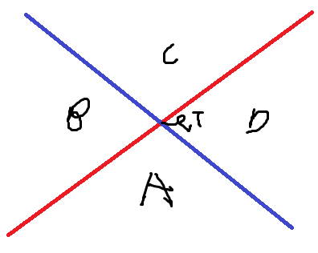

## 문제

[백준 23602](https://www.acmicpc.net/problem/23602)

### 대칭이동과 최소거리

직선을 경유하는 두 점 간의 거리의 최솟값을 구하는 테크닉이 있다. 검색하면 고1 과정 어쩌구 해서 바로 나온다. 요약하면 한 점을 직선에 대해 대칭이동 시키면 단순히 두 점 간의 거리를 구하는 문제로 환원시킬 수 있다는 테크닉이다. 이 문제도 이를 활용하여 구할 수 있다.

문제의 예시로 [case 1](https://www.desmos.com/calculator/imq44muynz)를 보자. 최단거리는 원점을 각 선에 대해 대칭이동한 $$P, Q$$ 를 이은 $$\overline{PQ}$$ 의 길이임을 쉽게 알 수 있다.

이와 비슷하게 [case 2](https://www.desmos.com/calculator/lguhdwozbf)를 보면 대칭이동한 점 $$Q$$ 와 원점을 이은 $$\overline{OQ}$$ 의 길이가 최단거리임을 알 수 있다.

하지만 [case 3](https://www.desmos.com/calculator/z7ffhcvznj)을 보면 대칭이동을 이용한 최단거리 직선을 만들 수 없음을 알 수 있다. 대신 최단거리는 $$\overline{PT}$$ 와 $$\overline{TQ}$$ 의 길이가 된다. 이는 다음을 통해 직관적으로 이해할 수 있다.
1. $$P$$ 에서 빨간 선의 초록영역을 지나 파란 선의 초록영역을 지나 $$Q$$ 로 가는 경로로 가야한다. 왜냐하면 이외의 구간은 원점과의 거리와 다른 직선 간의 거리가 모두 증가하게 되기 때문이다. 
2. 위 경로에서 검은 선을 반드시 지나게 된다. 이때 $$T'$$ 를 지나는 것보다 $$T$$ 를 지나는 것이 더 짧다. 

이를 일반화해서 대충 두 선을 그어서 아래처럼 영역을 나눠보자.

A 는 원점 $$O$$ 가 있는 곳이라고 하자. $$(P, Q)$$ 가 가능한 위치는 $${(B, C), (B, D), (C, C), (C, D)}$$ 가 된다. 각 경우에서 두 선의 교점인 $$T$$ 가 $$\triangle{OPQ}$$ 내부에 있으면 대칭이동을 이용한 최단거리 직선을 만들 수 없다.  이는 곧 case 3 을 적용할 수 있다. 나머지의 경우 case 1, 2 를 적용할 수 있다.

case 1, 2 의 경우 $$\triangle{OPQ}$$ 의 가장 긴 변이 길이가 정답이 된다. 각 경우에 대해서 대칭이동으로 인한 이등변삼각형을 이용해서 삼각형의 세 각중에 어디가 제일 큰지 체크하면 쉽게 증명할 수 있다.

### 시간 복잡도

= $$O(1)$$

### 코드



struct vec2 { double x, y; };
bool IsInside(const vec2& u, const vec2& v, const vec2& p)
{
    double d = u.x * v.y - u.y * v.x;
    double alpha = v.y * p.x - v.x * p.y;
    double beta = -u.y * p.x + u.x * p.y;
    alpha /= d;
    beta /= d;
    return 0 <= alpha && alpha <= 1 && 0 <= beta && beta <= 1 && alpha + beta <= 1;
}

int main()
{
    double a1, b1, c1;
    double a2, b2, c2;
    cin >> a1 >> b1 >> c1;
    cin >> a2 >> b2 >> c2;

    // u, v 는 원점을 각 선에 대해 대칭이동한 것
    double ux = 2 * a1 * c1 / (a1 * a1 + b1 * b1);
    double uy = 2 * b1 * c1 / (a1 * a1 + b1 * b1);
    double vx = 2 * a2 * c2 / (a2 * a2 + b2 * b2);
    double vy = 2 * b2 * c2 / (a2 * a2 + b2 * b2);

    double ans1 = sqrt((ux - vx) * (ux - vx) + (uy - vy) * (uy - vy));
    double ans2 = sqrt((ux) * (ux)+(uy) * (uy));
    double ans3 = sqrt((vx) * (vx)+(vy) * (vy));
    double ans = max(ans1, max(ans2, ans3));

    // 평항하지 않는다면
    if (a1 * b2 - a2 * b1 != 0)
    {
        // p = 두 선의 교점
        double d = 1 / (a1 * b2 - a2 * b1);
        double px = b2 * c1 - b1 * c2;
        double py = -a2 * c1 + a1 * c2;
        px *= d;
        py *= d;

        if (IsInside(vec2{ ux, uy }, vec2{ vx, vy }, vec2{ px, py }))
        {
            ans = 2 * sqrt(px * px + py * py);
        }
    }

    cout << setprecision(1000) << ans;
}

